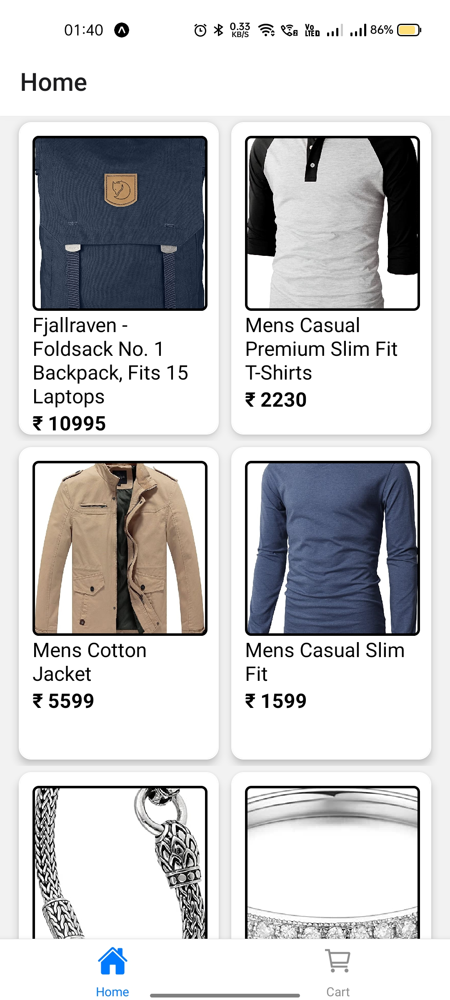
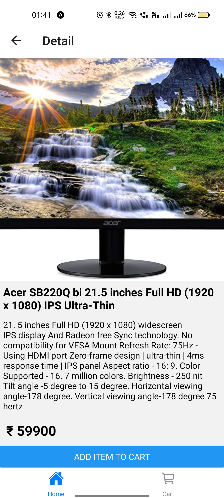
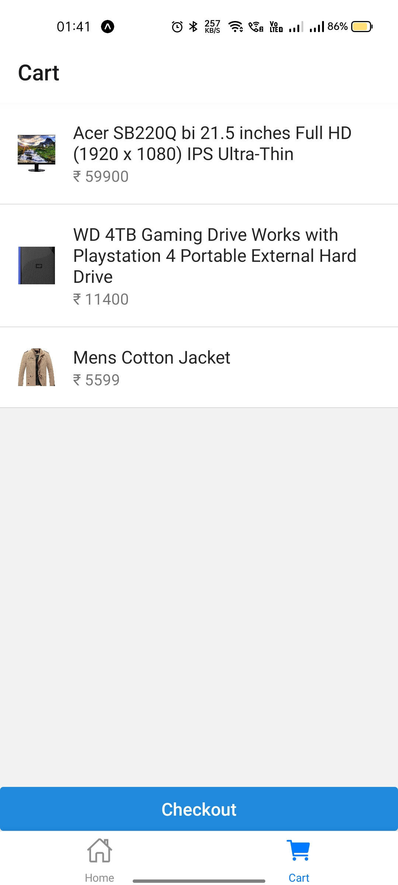

## Overview

Online shopping mobile application. Available for iOS and Android.
Developed as a personal project, created using [React Native](https://facebook.github.io/react-native/)


## Screenshot
<p justifyContent="space-between" >
   
   
   
</p>

## Installation

Make sure you have setup react native environment [here](https://reactnative.dev/docs/environment-setup)

Clone this repo

```
$ git clone https://github.com/OtakuKvothe/eCommerceApp.git
$ cd movies-app
```

Install dependencies

```sh
$ npm install
```

If you're running iOS, make sure you install the pods

```sh
$ cd ios
$ pod install
```

Run android or ios

```
$ npm run android
```

```
$ npm run ios
```

This project was made purely for educational purposes.